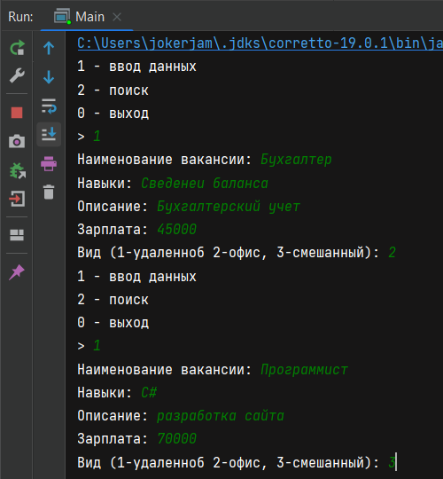
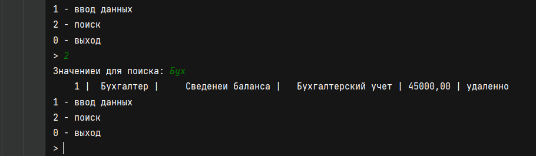
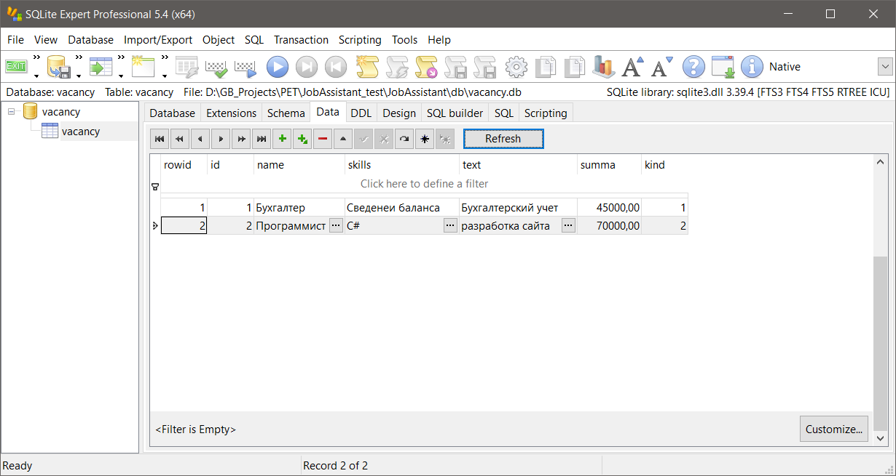

# Тестовое задание в пет-проект GB JobAssistant.

1. Разработать приложение в консольном интерфейсе, которое запрашивает данные по 5 параметрам:

+ Наименование вакансии
+ Ключевые навыки
+ Описание
+ Зарплата
+ Вид работы (удаленный, смешанный, в офисе)

2. Организовать запись в БД. (любая с которой работали)

3. Организовать выдачу из БД по запросу названия вакансии (Запрос целиком, запрос из 5 букв).

---

Реализация java 19.0.1. База данных - SQLite.

Скриншоты:

